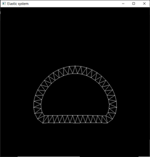

PhysicalSystem

FrameSystem和Mess-Spring为完全个人独立实现；

Gerstner波水面模拟借用了其他人编写的正弦波程序，个人实现了Gerstner波的算法。

## FrameSystem

框架：

火焰粒子贴图：

效果：

运动模糊参数：

~~~c++
float setLevel = 0.7;
~~~

~~~c++
float setLevel = 0.1;
~~~

碰撞检测：

~~~c++
Fire.addObject(new Sphere(glm::vec3(0, -26.8, 0), 3));
~~~

~~~c++
Fire.addObject(new Sphere(glm::vec3(2, -26.8, 0), 3));
~~~

## Mess-Spring

>   碰撞检测的碰撞平面不带摩擦系数！！！因为我懒了，就随便写了个sorry~
>
>   运动算法为Semi-implicit Euler，没有进行过参数分析，存在显式爆炸的可能！

1D弹性物体：绳子

~~~c++
void Elastic::set1D_rope (
        uint32_t Pointnumber, 
        glm::vec3 pos_, glm::vec3 scale_, 
        float_t springConst_, float_t frictionConst_
	)
{
	pos = pos_;
	scale = scale_;
	PointBufSize = Pointnumber;
	SpringBufSize = Pointnumber - 1;
	PointBuffer = new Point[PointBufSize];
	SpringBuffer = new Spring[SpringBufSize];

	float length = 3;
	glm::vec3 o(-1.5, 0, 0);
	glm::vec3 vel(0);
	int p = 0;
	PointBuffer[p].set(0.01, vel);
	PointBuffer[p].pos = o;
	PointBuffer[p].pos.x += length * (float)p / (float)Pointnumber;
	PointBuffer[p++].resetMode(POINT_STATIC);
	for (int s = 0; s < SpringBufSize; p++, s++)
	{
		PointBuffer[p].set(0.01, vel);
		PointBuffer[p].pos = o;
		PointBuffer[p].pos.x += length * (float)p / (float)Pointnumber;

		SpringBuffer[s].set(p - 1, p, springConst_, frictionConst_);
		SpringBuffer[s].setOriginLength(PointBuffer);
		std::cout << p << " " << s << std::endl;
		std::cout << PointBuffer[p].pos.x << std::endl;
	}
}
~~~

2D弹性物体：弹性环

~~~c++
void Elastic::set2D_ring (
        uint32_t Pointnumber, 
        glm::vec3 pos_, glm::vec3 scale_, 
        float_t springConst_, float_t frictionConst_
	)
{
	pos = pos_;
	scale = scale_;
	PointBufSize = 2 * Pointnumber;
	SpringBufSize = 4 * PointBufSize;
	//SpringBufSize = PointBufSize;
	PointBuffer = new Point[PointBufSize];
	SpringBuffer = new Spring[SpringBufSize];
	uint32_t springPtr = 0;
	glm::vec3 vel(0);
	float_t pi = (float_t)glm::pi<float_t>();
	// 外圈初始化；
	int p = 0;
	PointBuffer[p].set(0.001, vel);
	PointBuffer[p].pos.x = glm::cos(0);
	PointBuffer[p++].pos.y = glm::sin(0);

	for (; p < Pointnumber; p++)
	{
		PointBuffer[p].set(0.001, vel);
		PointBuffer[p].pos.x = glm::cos(2 * pi * p / Pointnumber);
		PointBuffer[p].pos.y = glm::sin(2 * pi * p / Pointnumber);
		SpringBuffer[springPtr].set(p - 1, p, springConst_, frictionConst_);
		SpringBuffer[springPtr++].setOriginLength(PointBuffer);
	}
	SpringBuffer[springPtr].set(Pointnumber-1, 0, springConst_, frictionConst_);
	SpringBuffer[springPtr++].setOriginLength(PointBuffer);

	// 内圈初始化，并链接内外圈；
	float_t del = 0.8;     // 内圈缩放比例；
	float_t delO = pi / Pointnumber;
	PointBuffer[p].set(0.001, vel);
	PointBuffer[p].pos.x = glm::cos(0 + delO) * del;
	PointBuffer[p++].pos.y = glm::sin(0 + delO) * del;

	SpringBuffer[springPtr].set(Pointnumber, 0, springConst_, frictionConst_);
	SpringBuffer[springPtr++].setOriginLength(PointBuffer);
	SpringBuffer[springPtr].set(Pointnumber, 1, springConst_, frictionConst_);
	SpringBuffer[springPtr++].setOriginLength(PointBuffer);

	for (uint32_t count = 1; p < PointBufSize; p++, count++)
	{
		PointBuffer[p].set(0.001, vel);
		PointBuffer[p].pos.x = glm::cos(2 * pi * count / Pointnumber + delO) * del;
		PointBuffer[p].pos.y = glm::sin(2 * pi * count / Pointnumber + delO) * del;
		SpringBuffer[springPtr].set(p - 1, p, springConst_, frictionConst_);
		SpringBuffer[springPtr++].setOriginLength(PointBuffer);
		// 内圈环和外圈环连接；
		SpringBuffer[springPtr].set(p, count, springConst_, frictionConst_);
		SpringBuffer[springPtr++].setOriginLength(PointBuffer);
		SpringBuffer[springPtr].set(p, (count + 1)%Pointnumber, springConst_, frictionConst_);
		SpringBuffer[springPtr++].setOriginLength(PointBuffer);
	}
	SpringBuffer[springPtr].set(PointBufSize - 1, Pointnumber, springConst_, frictionConst_);
	SpringBuffer[springPtr++].setOriginLength(PointBuffer);
	SpringBuffer[springPtr].set(PointBufSize - 1, 0, springConst_, frictionConst_);
	SpringBuffer[springPtr++].setOriginLength(PointBuffer);
	PointBufSize = PointBufSize > p ? p : PointBufSize;
	SpringBufSize = SpringBufSize > (--springPtr) ? springPtr : SpringBufSize;
}
~~~

>   弹性系数和阻尼系数都挺小，随便调了个不会爆炸的系数，所以有点软。

3D弹性物体：弹性正四面体

~~~c++
void Elastic::set3D_TriangularPyramid (
        glm::vec3 pos_, glm::vec3 scale_, 
        float_t springConst_, float_t frictionConst_
	)
{
   pos = pos_;
   scale = scale_;
   PointBufSize = 4;
   PointBuffer = new Point[PointBufSize];
   SpringBufSize = 6;
   SpringBuffer = new Spring[SpringBufSize];
   glm::vec3 vel(0);
   PointBuffer[0].set(0.01, vel);
   PointBuffer[1].set(0.01, vel);
   PointBuffer[2].set(0.01, vel);
   PointBuffer[3].set(0.01, vel);
   PointBuffer[0].pos.x=1;
   PointBuffer[1].pos.x=-1;
   PointBuffer[2].pos.x=0;
   PointBuffer[3].pos.x = 0;
   PointBuffer[0].pos.y=0;
   PointBuffer[1].pos.y=0;
   PointBuffer[2].pos.y = 1.7320508;
   PointBuffer[3].pos.y = 0.5773502;
   PointBuffer[3].pos.z = 1.7320508;
   SpringBuffer[0].set(0, 1, springConst_, frictionConst_);
   SpringBuffer[0].setOriginLength(PointBuffer);
   SpringBuffer[1].set(1, 2, springConst_, frictionConst_);
   SpringBuffer[1].setOriginLength(PointBuffer);
   SpringBuffer[2].set(2, 0, springConst_, frictionConst_);
   SpringBuffer[2].setOriginLength(PointBuffer);
   SpringBuffer[3].set(3, 1, springConst_, frictionConst_);
   SpringBuffer[3].setOriginLength(PointBuffer);
   SpringBuffer[4].set(3, 2, springConst_, frictionConst_);
   SpringBuffer[4].setOriginLength(PointBuffer);
   SpringBuffer[5].set(3, 0, springConst_, frictionConst_);
   SpringBuffer[5].setOriginLength(PointBuffer);
}
~~~

碰撞平面：

~~~c++
// 添加碰撞物体；
model.addObject(new ground(glm::vec3(0, 18.5, 0), glm::vec3(1, 1, 0)));
~~~

~~~c++
// 添加碰撞物体；
model.addObject(new ground(glm::vec3(0, 18, 0), glm::vec3(1, 1, 0)));
model.addObject(new ground(glm::vec3(0, 18, 0), glm::vec3(-1, 1, 0)));
~~~

## Gerstner波水面模拟

在本项目的Gerstner波模型中，Gerstner函数为：

其中，Y坐标值就是一个正弦波的偏移值，而XZ坐标值中的为波浪陡峭函数，即实现模拟Gerstner的特性的。

当$Q_i=0$时，Gerstner波即是正弦波：

当$1<Q_i<\frac{1}{w_iA_i}=1$时，Gerstner波为尖峰宽谷波：

其中，相比于指数水面模型，Gerstner波的波谷更加圆润，而波峰更加尖锐，这都是源于正弦波的坐标偏移所继承的源于正弦波的特性。显然可见，相比于指数模型，Gerstner波模型更符合实际水面的样子，因此在水面模拟中，它有着更好的效果。但相对于指数模型，Gerstner模型需要稍多一点算力，因为它需要额外计算XZ坐标值的偏移。

当$Q_i>\frac{1}{w_iA_i}=1$时，Gerstner波为尖峰卷曲波，这是一个不符合要求的水波：

**坐标计算**

~~~c++
inline float wave(int i, glm::vec2 v, float time)
{
	float frequency = 2 * PI_ / waveLength[i];	// w=2PI/L
	return amplitude[i] * glm::sin((d_ + time * speed[i]) * frequency);
}

inline float waveXZ(int i, glm::vec2 v, float time)
{
	float frequency = 2 * PI_ / waveLength[i];	// w=2PI/L
	return Q_parameter[i] * amplitude[i] * glm::cos((d_ + time * speed[i]) * frequency);
}

float waveHeight(glm::vec2 v, float time, float &get_x, float &get_z)
{
	float height = 0;
	get_x = v.x;
	get_z = v.y;
	for (int i = 0; i < numWaves; i++)
	{
		d_ = Dot(i, v);
		if (!d_) d_ = FLT_MIN;
		height += wave(i, v, time);
		get_x += waveXZ(i, v, time) * v.x / d_;
		get_z += waveXZ(i, v, time) * v.y / d_;
	}
	return height;
}
~~~

**法向计算**

~~~c++
inline float dWavedx(int i, glm::vec2 &v, float time)
{
	float frequency = 2 * PI_ / waveLength[i];
	float theta = d_;
	float A = amplitude[i] * v.x * frequency / theta;
	return A * glm::cos((theta + time * speed[i]) * frequency);
}
inline float dWavedy(int i, glm::vec2& v, float time)
{
	float frequency = 2 * PI_ / waveLength[i];
	float theta = d_;
	float A = amplitude[i] * frequency;
	return A * glm::sin((theta + time * speed[i]) * frequency) * Q_parameter[i];
}
inline float dWavedz(int i, glm::vec2& v, float time)
{
	float frequency = 2 * PI_ / waveLength[i];
	float theta = d_;
	float A = amplitude[i] * v.y * frequency / theta;
	return A * glm::cos((theta + time * speed[i]) * frequency);
}
glm::vec3 waveNormal(glm::vec2 v, float time)
{
	float dx = 0;
	float dy = 1;
	float dz = 0;
	for (int i = 0; i < numWaves; i++)
	{
		d_ = Dot(i, v);
		if (!d_) d_ = FLT_MIN;
		dx -= dWavedx(i, v, time);
		dy -= dWavedy(i, v, time);
		dz -= dWavedz(i, v, time);
	}
	glm::vec3 n(dx, dy, dz);

	float l = glm::length(n);
	return l ? n / l : glm::vec3(0, 1, 0);
}
~~~

**多振源**

~~~c++
#define numWaves 4
float amplitude[numWaves] =
{ 0.01,0.008,0.00007,0.00004 };	// 振幅		A_i
float waveLength[numWaves] =
{ 0.3,0.2,0.02,0.01 };			// 波长		L_i
float speed[numWaves] =
{ -0.2,-0.3,-0.1,-0.1 };		// 传播速度	S_i
glm::vec2 center[numWaves] =
{ 
	glm::vec2(2,10),
	glm::vec2(2,-10),
	glm::vec2(-1,-2),
	glm::vec2(1,-2),
};								// 传播原点	O
float Q_parameter[numWaves] =
{ 0.8,0.8,0.8,0.8 };
~~~

**单振源**

~~~c++
#define numWaves 1
float amplitude[numWaves] =
{ 0.1 };						// 振幅		A_i
float waveLength[numWaves] =
{ 0.1 * 2 * PI_ };				// 波长		L_i
float speed[numWaves] =
{ -0.2 };						// 传播速度	S_i
glm::vec2 center[numWaves] =
{ 
	glm::vec2(0,0)
};								// 传播原点	O
float Q_parameter[numWaves] =
{ 0 };
~~~

其中：

单振源$Q=1$

单振源$Q=3$

